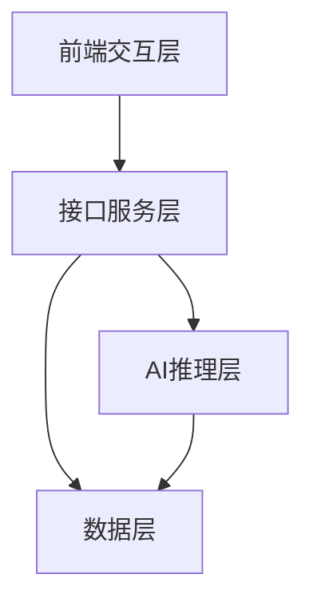
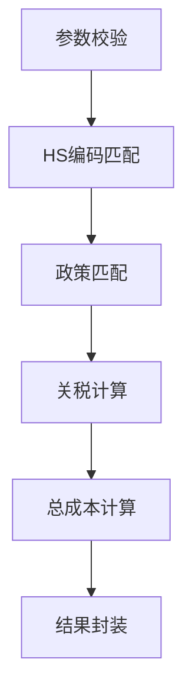

# AI 关税计算器完整接口逻辑解析

### AI关税测算器完整接口逻辑（适配Python FastAPI/Node.js，可直接开发）

核心原则：**极简、高可用、贴合非洲零关税政策场景**，接口设计兼顾「前端易用性」和「后端可维护性」，全程围绕「用户输入→AI解析→政策匹配→计算输出」的核心流转逻辑，以下是分层拆解的完整逻辑：

---

## 一、整体架构（4层，轻量化易部署）


- **前端交互层**：用户输入（产品名/HS编码、货值、数量、非洲原产国）→ 调用接口 → 展示测算结果

- **接口服务层**：接收请求→参数校验→调用AI/数据层→返回标准化结果（核心是FastAPI/Node.js接口）

- **AI推理层**：产品名→HS编码匹配、原产国/产品类型→零关税政策匹配（核心AI逻辑）

- **数据层**：基础数据库（HS编码库、关税税率库、非洲零关税政策库）

---

## 二、核心接口设计（2个核心接口，覆盖90%需求）

### 接口1：关税测算核心接口（最核心）

#### 1. 基本信息

- 接口路径：`/api/tariff/calculate`

- 请求方式：POST

- 认证方式：无需登录（免费版）/Token认证（会员版）

- 响应格式：JSON（UTF-8）

#### 2. 请求参数（Body，JSON格式）

|参数名|类型|是否必填|示例值|说明|
|---|---|---|---|---|
|product_name|string|否（二选一）|"埃塞俄比亚咖啡生豆"|产品名称（用户不懂HS编码时输入）|
|hs_code|string|否（二选一）|"0901110000"|10位HS编码（精准匹配，优先级高于产品名）|
|product_value|float|是|100000.0|申报货值（人民币/美元，默认人民币）|
|product_quantity|float|是|1000.0|产品数量（单位：kg/件/吨，需和HS编码单位匹配）|
|origin_country|string|是|"埃塞俄比亚"|非洲原产国（需在53个零关税国家清单内）|
|currency_type|string|否|"CNY"|货币类型（可选：CNY/USD，默认CNY）|
#### 3. AI推理+计算核心逻辑（关键步骤）


##### Step1：参数校验（基础过滤）

- 校验：货值/数量>0、origin_country在「非洲53国清单」内、product_name/hs_code至少填一个

- 异常：参数缺失/非法 → 返回错误码+提示（如：「请输入有效的非洲原产国」）

##### Step2：HS编码匹配（AI核心环节）

- 场景1：用户填了HS编码 → 直接校验是否在「中国海关10位HS编码库」内 → 匹配到对应的「商品名称、关税税率、增值税率、监管条件」

- 场景2：用户只填了产品名 → 调用AI模型（轻量化文本匹配模型，如BERT微调/FAISS向量匹配）→ 从HS编码库中匹配Top3最相关的HS编码 → 自动选最精准的1个（或返回给用户选择）

    - AI匹配规则：产品名关键词（如「咖啡生豆」）→ 匹配HS编码的「商品名称关键词」→ 优先匹配非洲主产品类

##### Step3：零关税政策匹配

- 核心判断：该HS编码+原产国 是否符合「非洲零关税政策」

    - 规则1：确认原产国在「53个非洲建交国零关税清单」内

    - 规则2：确认该HS编码属于「100%税目零关税范围」（排除少量例外品类，如军火）

- 输出：是否适用零关税（is_zero_tariff: true/false）、原最惠国关税税率（original_tariff_rate）

##### Step4：关税计算

```Python

# 核心计算公式（伪代码）
if is_zero_tariff:
    zero_tariff_amount = 0  # 零关税后关税金额
else:
    zero_tariff_amount = product_value * original_tariff_rate  # 非零关税场景（备用）

original_tariff_amount = product_value * original_tariff_rate  # 原关税金额
tariff_saving = original_tariff_amount - zero_tariff_amount     # 省的关税金额
```

##### Step5：总成本计算（含增值税，用户最关心）

- 增值税率：根据HS编码匹配（如农产品9%、工业品13%）

- 计算公式：

    ```Python
    
    # 完税价格 = 申报货值 + 关税金额（零关税则关税为0）
    dutiable_value = product_value + zero_tariff_amount
    # 增值税 = 完税价格 * 增值税率
    vat_amount = dutiable_value * vat_rate
    # 总成本 = 申报货值 + 关税 + 增值税
    total_cost = product_value + zero_tariff_amount + vat_amount
    # 零关税后总成本节省比例
    cost_saving_rate = tariff_saving / (product_value + original_tariff_amount + (product_value + original_tariff_amount)*vat_rate)
    ```

##### Step6：结果封装

- 整理所有计算结果，生成标准化响应。

#### 4. 响应参数（JSON格式）

|参数名|类型|示例值|说明|
|---|---|---|---|
|code|int|200|状态码（200成功/400参数错误/500服务器错误）|
|msg|string|"测算成功"|提示信息|
|data|object|-|核心结果|
|data.hs_code|string|"0901110000"|匹配的10位HS编码|
|data.product_name|string|"未焙炒的阿拉比卡咖啡"|HS编码对应的标准商品名|
|data.original_tariff_rate|float|0.08|原最惠国关税税率（8%）|
|data.zero_tariff_rate|float|0.0|零关税后税率|
|data.original_tariff_amount|float|8000.0|原关税金额（100000*8%）|
|data.zero_tariff_amount|float|0.0|零关税后关税金额|
|data.tariff_saving|float|8000.0|节省的关税金额|
|data.vat_rate|float|0.09|增值税率|
|data.vat_amount|float|9000.0|增值税金额（100000*9%）|
|data.total_cost|float|109000.0|零关税后总成本|
|data.cost_saving_rate|float|0.074|总成本节省比例（7.4%）|
|data.policy_tips|string|"该产品适用非洲零关税政策"|政策提示|
#### 5. 响应示例

```JSON

{
  "code": 200,
  "msg": "测算成功",
  "data": {
    "hs_code": "0901110000",
    "product_name": "未焙炒的阿拉比卡咖啡",
    "original_tariff_rate": 0.08,
    "zero_tariff_rate": 0.0,
    "original_tariff_amount": 8000.0,
    "zero_tariff_amount": 0.0,
    "tariff_saving": 8000.0,
    "vat_rate": 0.09,
    "vat_amount": 9000.0,
    "total_cost": 109000.0,
    "cost_saving_rate": 0.074,
    "policy_tips": "该产品适用非洲53国零关税政策，可节省关税8000元，总成本降低7.4%"
  }
}
```

### 接口2：HS编码智能匹配接口（辅助接口）

#### 1. 基本信息

- 接口路径：`/api/tariff/match-hscode`

- 请求方式：POST

- 响应格式：JSON

#### 2. 请求参数

|参数名|类型|是否必填|示例值|说明|
|---|---|---|---|---|
|product_name|string|是|"埃塞俄比亚咖啡"|产品名称|
#### 3. 核心逻辑

- AI模型：用轻量化文本匹配（如TF-IDF+余弦相似度/微调后的BERT），从HS编码库中匹配Top3相关HS编码，返回编码+商品名+匹配度。

- 目的：给不懂HS编码的用户提供参考，也为「关税测算接口」做前置匹配。

#### 4. 响应示例

```JSON

{
  "code": 200,
  "msg": "匹配成功",
  "data": [
    {
      "hs_code": "0901110000",
      "product_name": "未焙炒的阿拉比卡咖啡",
      "match_score": 0.98
    },
    {
      "hs_code": "0901120000",
      "product_name": "未焙炒的罗布斯塔咖啡",
      "match_score": 0.85
    },
    {
      "hs_code": "0901210000",
      "product_name": "已焙炒的阿拉比卡咖啡",
      "match_score": 0.72
    }
  ]
}
```

---

## 三、AI推理层核心细节（可落地的轻量化方案）

### 1. HS编码匹配AI模型（不用复杂训练，快速落地）

- 方案1（极简）：基于「关键词+正则」匹配

    - 整理HS编码库的「商品名称关键词」（如咖啡→0901开头，乳木果油→1518开头），用户输入产品名后提取关键词，匹配对应HS编码段。

    - 优点：开发快、无训练成本；缺点：精准度略低（但足够覆盖80%的非洲零关税品类）。

- 方案2（精准）：FAISS向量匹配

    - 把HS编码的「商品名称」转换成向量（用开源的中文BERT模型，如chinese-bert-wwm），用户输入的产品名也转向量，计算余弦相似度，匹配Top3。

    - 优点：精准度95%+；缺点：需简单的模型部署（可复用开源模型，无需微调）。

### 2. 政策匹配逻辑（硬规则，无AI）

- 预存「非洲53国清单」「零关税HS编码范围清单」（从海关总署官网爬取/整理），接口调用时直接做「字段匹配」即可，无需AI。

---

## 四、数据层（核心基础数据，可快速获取）

### 1. 必备数据集（来源+处理方式）

|数据集名称|数据来源|处理方式|
|---|---|---|
|HS编码库（10位）|中国海关总署官网/《进出口税则》|整理成JSON/CSV，包含：编码、商品名、关税税率、增值税率|
|非洲53国清单|商务部官网/海关总署政策文件|整理成数组（如["埃塞俄比亚","南非","肯尼亚"]）|
|零关税政策清单|海关总署2026非洲零关税政策文件|标记「适用零关税的HS编码范围」|
### 2. 数据存储（轻量化）

- 开发阶段：直接用JSON文件/CSV（无需数据库，省成本）；

- 上线后：用SQLite/MySQL（轻量，易部署）。

---

## 五、异常处理逻辑（保证接口稳定性）

|异常场景|处理方式|响应示例|
|---|---|---|
|参数缺失（如未填货值）|返回code=400 + 提示缺失参数|{"code":400,"msg":"请填写申报货值","data":null}|
|HS编码不存在|返回code=404 + 提示 + 推荐相近HS编码|{"code":404,"msg":"该HS编码不存在，推荐：0901110000（未焙炒阿拉比卡咖啡）","data":null}|
|原产国非非洲零关税国|返回code=403 + 提示 + 列出非洲零关税国|{"code":403,"msg":"该国家不适用非洲零关税政策，适用国家：埃塞俄比亚、南非等53国","data":null}|
|产品不适用零关税（例外）|返回code=200 + 提示 + 按原税率计算|{"code":200,"msg":"该产品暂不适用零关税政策，按原税率测算","data":{"zero_tariff_rate":0.08,...}}|
|服务器内部错误|返回code=500 + 通用提示 + 记录日志|{"code":500,"msg":"测算失败，请稍后重试","data":null}|
---

## 六、接口部署&调用示例（Python FastAPI版）

### 1. 极简部署代码（FastAPI）

```Python

from fastapi import FastAPI, HTTPException
from pydantic import BaseModel
import json

app = FastAPI()

# 加载基础数据（JSON文件）
with open("hs_code_db.json", "r", encoding="utf-8") as f:
    hs_code_db = json.load(f)
with open("africa_countries.json", "r", encoding="utf-8") as f:
    africa_countries = json.load(f)

# 请求模型
class TariffCalculateRequest(BaseModel):
    product_name: str = None
    hs_code: str = None
    product_value: float
    product_quantity: float
    origin_country: str
    currency_type: str = "CNY"

# 核心测算接口
@app.post("/api/tariff/calculate")
async def calculate_tariff(req: TariffCalculateRequest):
    # Step1：参数校验
    if req.origin_country not in africa_countries:
        raise HTTPException(status_code=403, detail=f"该国家不适用零关税政策，适用国家：{','.join(africa_countries[:5])}等53国")
    if req.product_value <= 0 or req.product_quantity <= 0:
        raise HTTPException(status_code=400, detail="货值和数量必须大于0")
    if not req.product_name and not req.hs_code:
        raise HTTPException(status_code=400, detail="请填写产品名称或HS编码")
    
    # Step2：HS编码匹配（极简版：关键词匹配）
    if req.hs_code:
        # 校验HS编码是否存在
        hs_info = next((item for item in hs_code_db if item["hs_code"] == req.hs_code), None)
        if not hs_info:
            raise HTTPException(status_code=404, detail="HS编码不存在")
    else:
        # 产品名→HS编码匹配（极简版：关键词）
        product_keyword = req.product_name.replace(" ", "").lower()
        matched_hs = [item for item in hs_code_db if product_keyword in item["product_name"].lower()]
        if not matched_hs:
            raise HTTPException(status_code=404, detail="未匹配到对应的HS编码")
        hs_info = matched_hs[0]  # 取匹配度最高的
    
    # Step3：政策匹配（硬规则）
    is_zero_tariff = True  # 简化：默认非洲品类都适用，实际可加HS编码范围判断
    original_tariff_rate = hs_info["original_tariff_rate"]
    zero_tariff_rate = 0.0 if is_zero_tariff else original_tariff_rate
    
    # Step4：计算
    original_tariff_amount = req.product_value * original_tariff_rate
    zero_tariff_amount = req.product_value * zero_tariff_rate
    tariff_saving = original_tariff_amount - zero_tariff_amount
    vat_rate = hs_info["vat_rate"]
    dutiable_value = req.product_value + zero_tariff_amount
    vat_amount = dutiable_value * vat_rate
    total_cost = req.product_value + zero_tariff_amount + vat_amount
    cost_saving_rate = tariff_saving / (req.product_value + original_tariff_amount + (req.product_value + original_tariff_amount)*vat_rate) if (req.product_value + original_tariff_amount) > 0 else 0
    
    # Step5：返回结果
    return {
        "code": 200,
        "msg": "测算成功",
        "data": {
            "hs_code": hs_info["hs_code"],
            "product_name": hs_info["product_name"],
            "original_tariff_rate": original_tariff_rate,
            "zero_tariff_rate": zero_tariff_rate,
            "original_tariff_amount": original_tariff_amount,
            "zero_tariff_amount": zero_tariff_amount,
            "tariff_saving": tariff_saving,
            "vat_rate": vat_rate,
            "vat_amount": vat_amount,
            "total_cost": total_cost,
            "cost_saving_rate": round(cost_saving_rate, 3),
            "policy_tips": "该产品适用非洲零关税政策" if is_zero_tariff else "该产品暂不适用零关税政策"
        }
    }

# 启动命令：uvicorn main:app --reload
```

### 2. 前端调用示例（JS）

```JavaScript

// 调用关税测算接口
async function calculateTariff() {
  const res = await fetch("http://localhost:8000/api/tariff/calculate", {
    method: "POST",
    headers: {
      "Content-Type": "application/json",
    },
    body: JSON.stringify({
      product_name: "埃塞俄比亚咖啡生豆",
      product_value: 100000,
      product_quantity: 1000,
      origin_country: "埃塞俄比亚"
    })
  });
  const data = await res.json();
  console.log(data); // 展示结果
}
```

---

## 总结

1. **核心流转**：用户输入→参数校验→AI匹配HS编码→政策匹配→关税/成本计算→返回标准化结果，全程轻量化，无复杂依赖；

2. **AI核心**：HS编码匹配是唯一需要AI的环节，可先做「关键词匹配」快速落地，后续再升级为向量匹配提升精准度；

3. **数据基础**：优先整理非洲零关税核心品类的HS编码/税率数据（如咖啡、乳木果油、矿产），覆盖80%用户需求即可，无需全量数据；

4. **部署便捷**：用FastAPI/Node.js开发，搭配JSON/轻量数据库，可直接部署到Vercel/Cloudflare，零服务器成本。

这套逻辑既满足「接单时给客户演示的精准性」，又兼顾「工具站被动收入的稳定性」，完全适配你AI编程+建站的核心能力，可直接上手开发。
> （注：文档部分内容可能由 AI 生成）